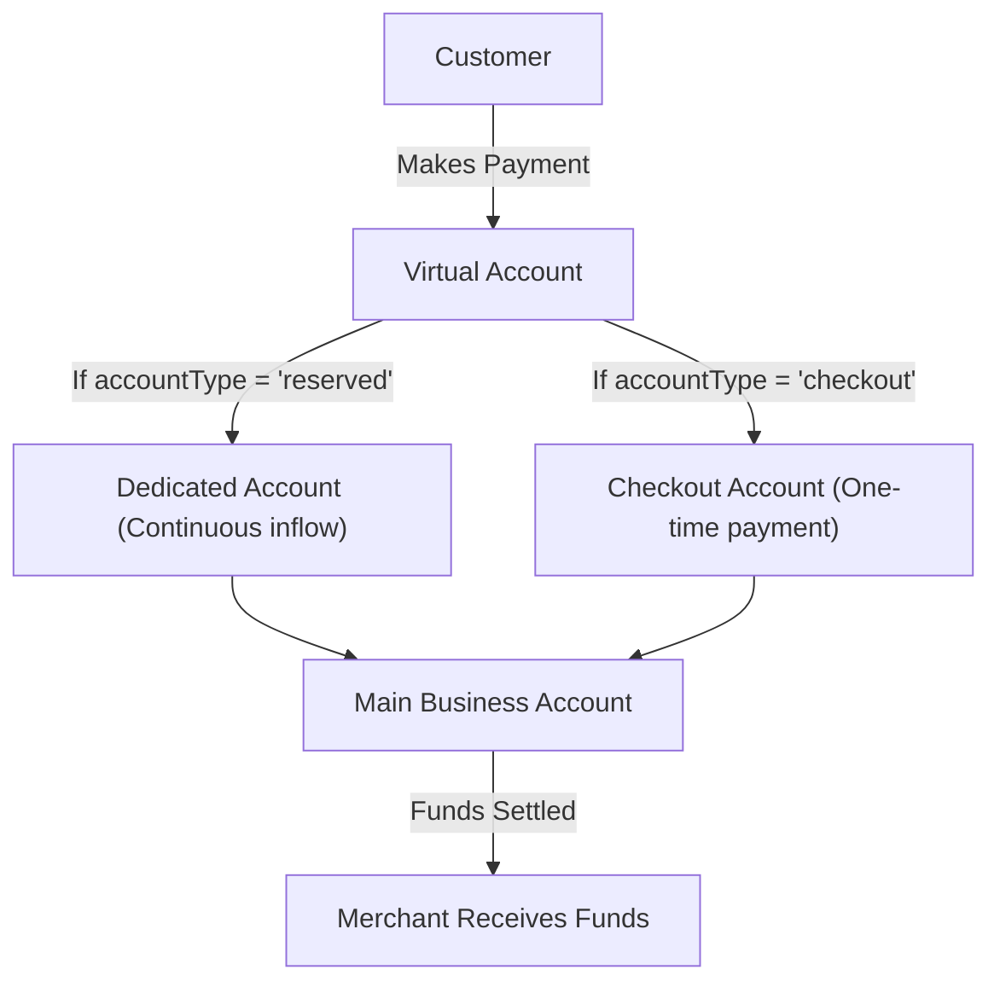

## Overview

Virtual accounts can also serve as a means of accepting payment. It's a unique account created for a single customer with an `accountName` and bank account number attached to them. This account can be used to receive transfer inflows from banks.

<Info>
  Virtual accounts are not a pocket of funds, as they only keep a record of transaction inflow to the owner for reconciliation purposes. All inflow is routed back to the business accounts.
</Info>

## Fetch supported settlement banks

Novac has a list of supported banks you can pick from based on your preference when creating a virtual account. 

```bash Request
curl --request GET \
  --url https://api.novacpayment.com/api/v1/virtual-accounts/bank-list \
  --header 'Authorization: <secret-key>'
```
```json Response
{
    "status": true,
    "message": "Available Banks retrieved",
    "data": [
        {
            "bankCode": "000036",
            "bankName": "Optimus Bank"
        },
    ]
}
```

## Virtual account Types

When creating a virtual account, you must specify the account type via the accountType field. Novac supports two types of virtual accounts.



This flow explain how funds received via a virtual accounts will be routed back to the merchant business account. 

### Reserved or dedicated virtual account

To create a dedicated virtual account, set `accountType` to "reserved".
This type of account is ideal for receiving continuous inflows over time, perfect for use cases such as wallet systems, savings apps, or betting platforms, where each customer has a permanent account number assigned to them.

<Note> 
   `reserved` accounts do not expire.
   When using `"reserved"` as the account type, set the `amount` field open. This indicates that the account can accept variable amounts rather than being tied to a fixed amount per transaction. 
</Note>

### Checkout

To create a temporary checkout account, set accountType to "checkout".
This type of account is used for one-time payments or time-limited checkout sessions. You can define how long the account remains active using the `expiryInMinutes` field.

<Note> 
   By default `"checkout"` account expires in 20mins. However, you can extend this time by setting your preferred time.
</Note>

## Create a virtual account

Novac allows merchants to generate virtual accounts for customers to receive payments seamlessly.
When making the request, keep the following in mind:

- `amount` – If supplied, the customer can only pay this exact amount per transaction.
- `expiryInMinutes` – Defines how long the virtual account remains active before it expires.

```bash expandable Request
   curl --request POST \
  --url https://api.novacpayment.com/api/v1/virtual-account \
  --header 'Authorization: <secret-key>' \
  --header 'Content-Type: application/json' \
  --data '{
    "reference": "<string>",
    "amount": 123,
    "accountType": "<string>",
    "accountName": "<string>",
    "bankCode": "<string>",
    "firstName": "<string>",
    "lastName": "<string>",
    "customerEmail": "<string>",
    "expiryInMinutes": 123
  }'
```

```json expandable Response
{
    "status": true,
    "message": "Virtual account generated",
    "data": {
        "accountNumber": "0830706484",
        "accountName": "Makanju Femi",
        "bankCode": "000000",
        "bankName": "Test NOVAC VA",
        "accountType": "reserved",
        "accountStatus": "active",
        "expiryInMinutes": 30,
        "reference": "1oVaJQQHLyQqqf1SwxjSpudeA069",
        "createdAt": "2025-10-06T22:46:48.5102348Z",
        "requestedAmount": 0,
        "expectedAmount": 0
    }
}
```

The response payload contains the `requestedAmount` as the original amount passed when you select checkout as your virtual account type. While the `expectedAmount` will be the original amount plus charges, as this is supposed to be a flash checkout account used for one-time payment.

## What next ?

You can retrieve details of a virtual account using any of the following endpoints:

- [Fetch virtual account by account number](/api-reference/virtual-account/retrieve-virtual-account-by-reference)
- [Fetch virtual account by account reference](/api-reference/virtual-account/retrieve-virtual-account-by-account-number)


