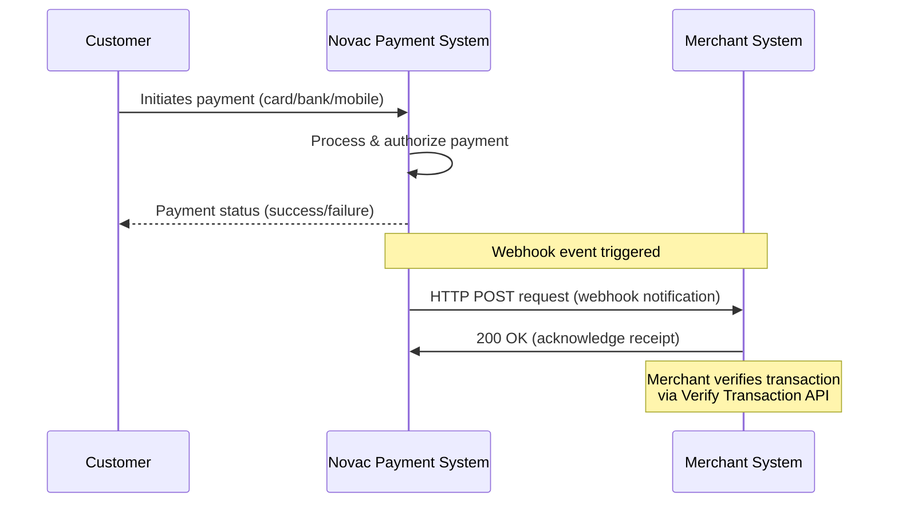

## Overview  

Webhooks are a communication mechanism that enable event-driven notifications between systems. When an event occurs in System A, it notifies System B in real time without requiring System B to constantly check for updates. Typically, System B subscribes to these notifications by providing a publicly accessible URL to System A.

<Note> 
  Webhook URLs must be publicly accessible at all times in order to receive notifications.   
</Note>

In Novac, implementing webhooks works the same way. After a transaction is completed, Novac will send real-time updates to your application via a `POST` request to the webhook URL you configured. Instead of polling the API for payment status, your system will automatically be notified whenever a payment event occurs.

This makes it easier to keep your system in sync with payment statuses.  

## Process Flow

<Note>
  You don’t need to manually subscribe to webhook events.  
  Once you configure your webhook URLs in the dashboard, Novac automatically sends notifications whenever relevant events occur in your account.
</Note>



This flow shows how Novac triggers a webhook event once a payment is processed, enabling your system to confirm the payment status automatically.

---

## Setting Up Your Webhook

<Steps>
  <Step title="Step 1 - Log in to your Novac Dashboard">
    Sign in to your [**Novac Dashboard**](https://app.novacpayment.com) using your account credentials.  
  </Step>

  <Step title="Step 2 - Navigate to Webhooks">
    From the sidebar menu, go to Settings, Click on API settings tab.  
    This is where you can configure both test and live webhook URLs.
  </Step>

  <Step title="Step 3 - Add your Webhook URLs and Click on Save">
    Enter the publicly accessible URLs where you want to receive webhook notifications.  
  </Step>
</Steps>

<Note>
    - Add a test webhook URL for test transactions.  
    - Add a live webhook URL for real payments in production.  
    - Ensure the URLs are always available and accept `POST` requests.
</Note>

Novac will send an HTTP `POST` request to these URLs after a transaction is completed.  

---

## Notification Types

| Notify Type  | Description                                        | Common Scenario                                  |
| ------------ | -------------------------------------------------- | ------------------------------------------------ |
| `successful` | Payment or transaction was processed successfully. | A customer’s card or bank transfer succeeded.    |
| `failed`     | Transaction attempt failed or was declined.        | Insufficient funds or incorrect payment details. |
| `reversed`   | A previously successful transaction was reversed.  | Refunds or chargeback scenarios.                 |
| `abandoned`  | Transaction was started but not completed.         | Customer exited before finalizing payment.       |

---

## Webhook Request Format  
Each webhook request payload sent from Novac follows the structure below:
```json expandable Webhook format
{
  "data": {
    "id": 0,
    "card": {
      "type": "",
      "token": "",
      "issuer": "",
      "country": "",
      "last4Digits": "",
      "first6Digits": ""
    },
    "amount": 300,
    "domain": "live",
    "status": "failed | reversed | successful | abandoned",
    "channel": "",
    "currency": "NGN",
    "customer": {
      "id": 0,
      "name": "",
      "email": "",
      "customerCode": ""
    },
    "requestIp": "",
    "redirectUrl": "",
    "chargedAmount": 0,
    "transactionFee": 0,
    "transferDetail": {
      "bankCode": "",
      "bankName": "",
      "sessionId": "",
      "accountNumber": "",
      "originatorName": "",
      "creditAccountName": "",
      "originatorAccountNumber": ""
    },
    "checkoutMetadata": "{}",
    "authorizationCode": "",
    "paymentDescriptor": "NOVAC",
    "gatewayResponseCode": "",
    "transactionReference": ""
  },
  "notify": "transaction | wallet_funding | banktransfer",
  "notifyType": "failed | reversed | successful | abandoned"
}
```

The webhook structure provides complete details about the transaction event, including customer, card, and transfer details.

---

## Verifying Webhook Source

Webhooks are publicly available URLs; this means that anyone can fake a webhook sample and send a fake request to your system. It's important to verify that all webhooks received are from Novac to avoid man-in-the-middle attacks. 

To verify that this webhook event is coming from us, we advise merchants to use IP whitelisting. We provide our IP address, and you should verify that every webhook request comes from this address.

--

## Retries
