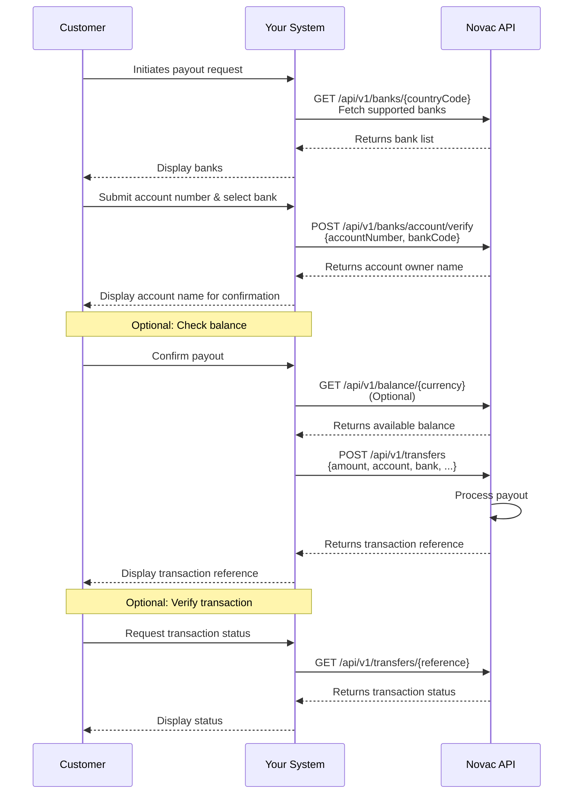

## Overview  

The payout flow describes the complete process of sending funds from your Novac account to a customer’s settlement account.  
It ensures that every payout is validated, securely processed, and easily verifiable.

To initiate a payout, your integration follows this flow:

1. Fetch supported banks with country code.

2. Verify the recipient’s bank account.

3. (Optionally)Check your balance.

4. Initiate the payout.

5. Verify the transaction status by reference.

## How payout flow works

### Supported Countries

| Country                | Currency          | Country Code      |
|------------------------|-------------------|-------------------|
| Nigeria                | NGN               | NG                |             
| Kenya                  | KES               | KE                |

### Get supported payout banks based on country

When a customer initiates a payout request, your system begins by fetching the list of supported banks from Novac by sending a [GET request](/api-reference/payouts/retrieve-payout-banks) to the endpoint `/api/v1/banks/{countryCode}`.

<Info>
  Novac supports payouts in multiple regions across Africa. You can retrieve each country's list of supported settlement banks by passing the country code as a path parameter in the endpoint above.
</Info>

This allows you to display the available banks for the customer to select from.

---

### Verify customer settlement account

After the customer selects a destination bank and enters their account number, your system should verify the account details by making a [POST request](/api-reference/payouts/verify-bank-account) to `/api/v1/banks/account/verify`.

This verification confirms that the account exists and returns the account holder’s name, which can then be displayed to the customer for confirmation.

Before proceeding with the payout, your system can optionally check the available balance by sending a [GET request](/api-reference/payouts/retrieve-balance) to `/api/v1/balance/{currency}` to ensure sufficient funds.

---

### Initiate a payout request

Once the customer confirms the payout, your system sends a [POST request](/api-reference/payouts/initiate-transfer) to `/api/v1/transfers`, including the payout details such as the amount, bank, and account information.  

Novac processes the transaction and returns a unique transaction reference, which your system can display to the customer as proof of submission.

Finally, to verify the payout’s completion, your system can send a [GET request](/api-reference/payouts/retrieve-bank-transaction) to `/api/v1/transfers/{reference}` using the transaction reference returned earlier.  

This endpoint provides the current transaction status such as "pending", "successful", or "failed" allowing your system to communicate the result back to the customer.  

This complete flow ensures that every payout is securely processed, verified, and transparently tracked from initiation to confirmation.

